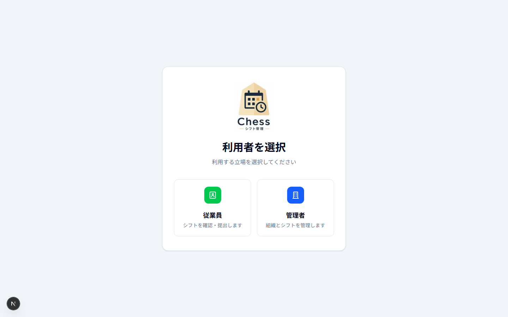
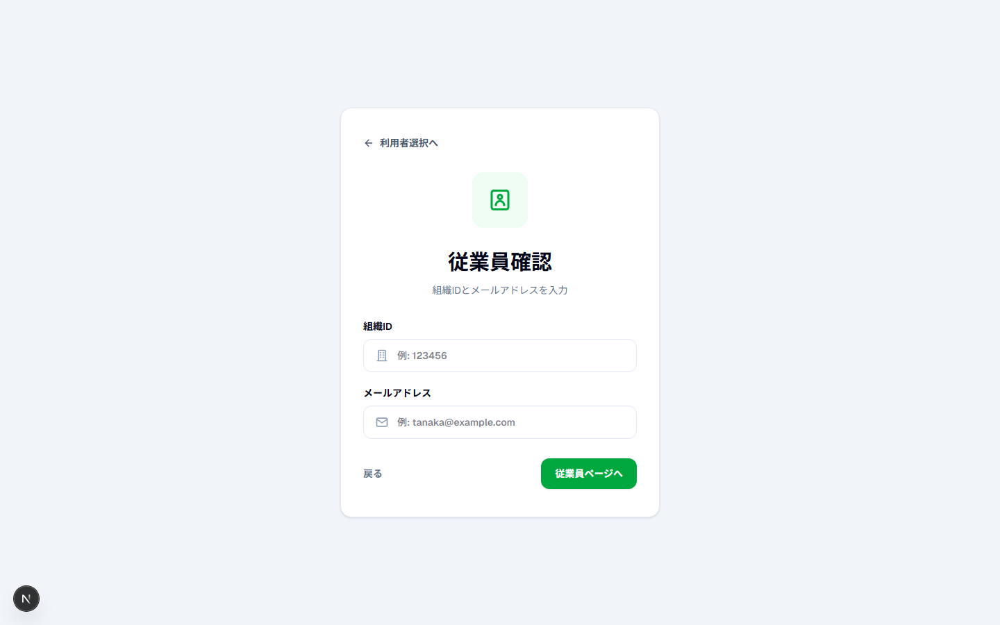
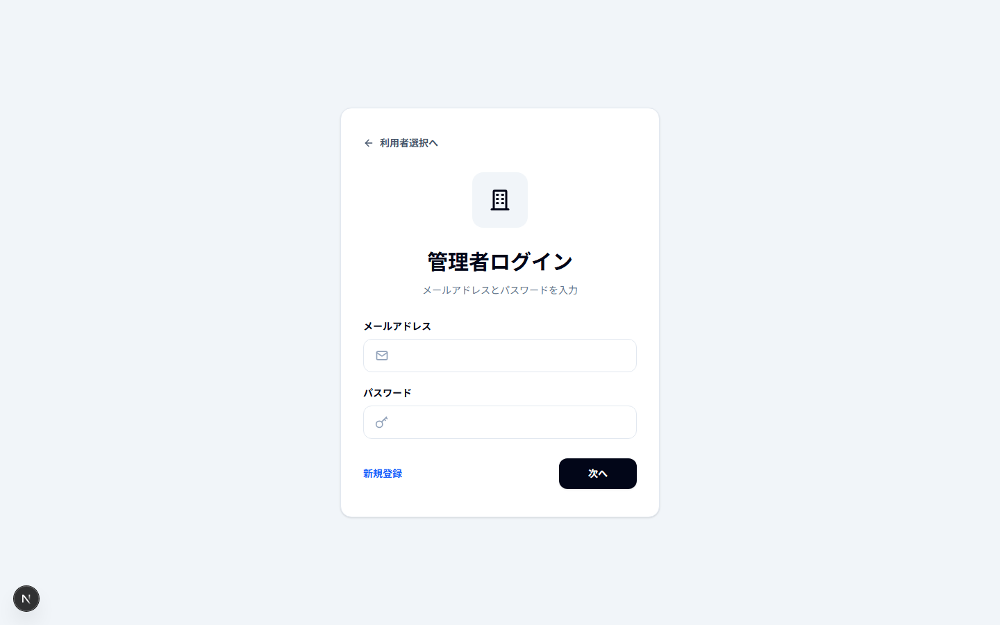
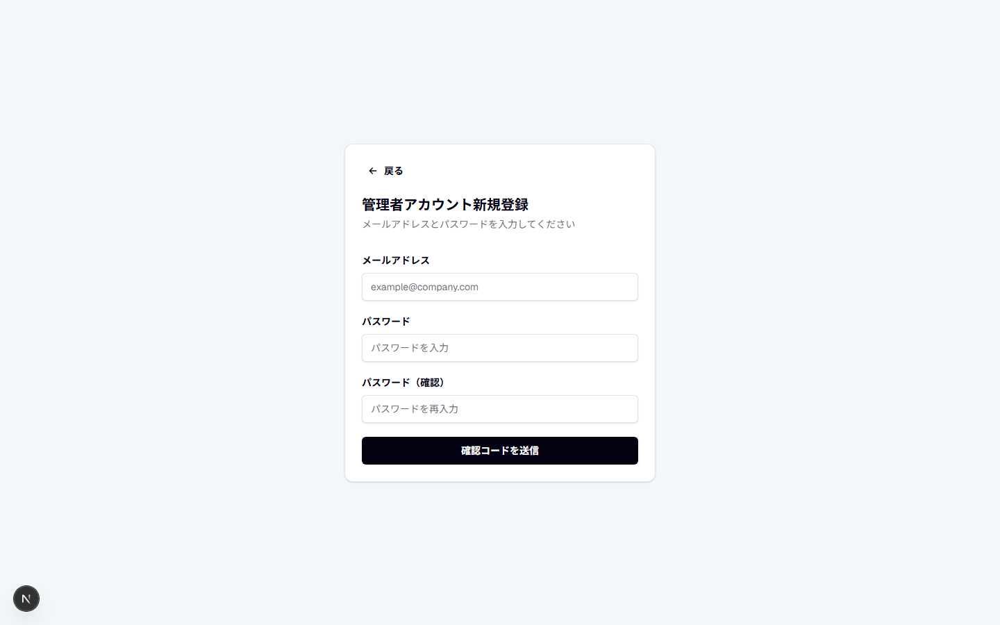
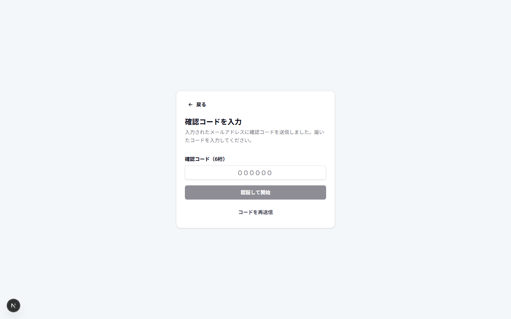
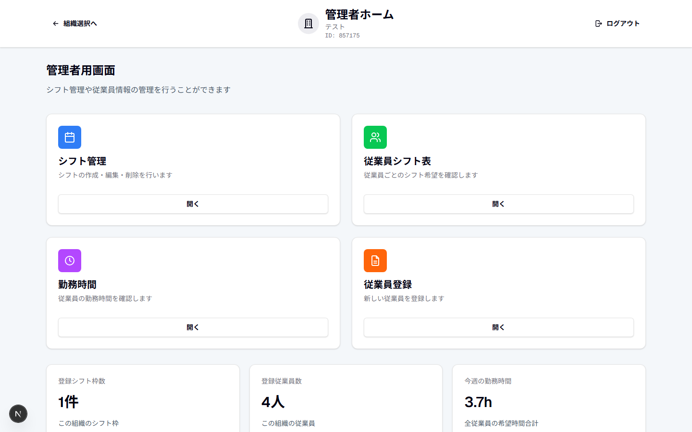
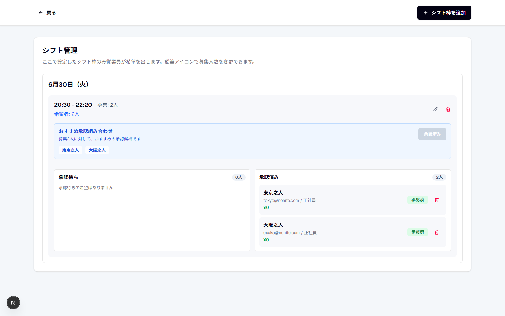
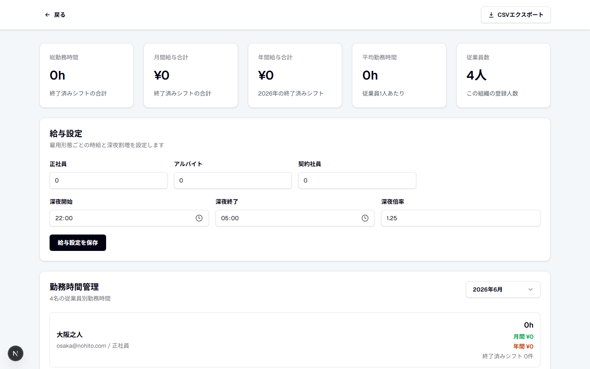
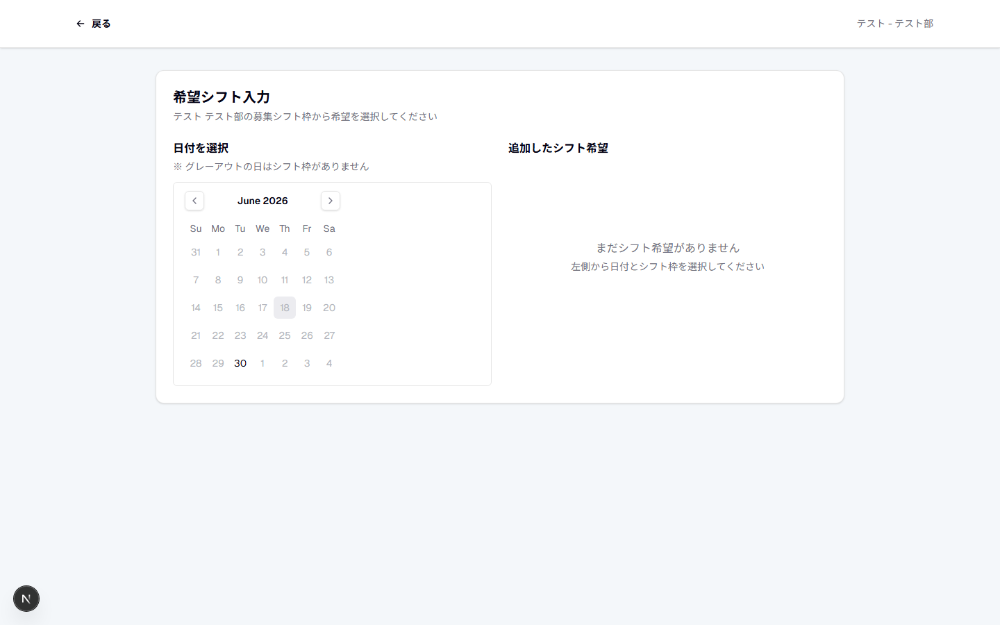

# Chess

管理者のシフト作成と、従業員の希望提出をまとめて行えるシフト管理システムです。
従業員同士の「一緒に働きやすさ」も考慮し、現場に合ったシフト作成を支援します。

## できること

| 管理者 | 従業員 |
| --- | --- |
| 組織・従業員・シフト枠の管理 | 組織IDとメールアドレスでログイン |
| 希望の確認、承認、おすすめ候補の表示 | 希望シフトの選択・提出 |
| 勤務時間・給与設定、CSV出力 | 勤務時間・給与・承認状況の確認 |
| 従業員別シフト表の確認 | 一緒に働きやすさの登録 |

## 画面紹介

### 1. 利用者を選択

従業員または管理者を選び、それぞれのログイン画面へ進みます。



<details>
<summary><strong>ログイン・登録画面を見る</strong></summary>

| 従業員ログイン | 管理者ログイン |
| --- | --- |
|  |  |

| 管理者新規登録 | 登録フォーム |
| --- | --- |
|  |  |



</details>

### 2. 管理者がシフトを管理

シフト枠、希望者、従業員、勤務時間と給与を一つの管理画面から確認できます。



<details>
<summary><strong>管理者画面をすべて見る</strong></summary>

| 組織選択 | 組織追加 |
| --- | --- |
|  |  |

| シフト管理 | 従業員シフト表 |
| --- | --- |
|  |  |

| 従業員登録 | 勤務時間・給与設定 |
| --- | --- |
|  |  |

</details>

### 3. 従業員が希望を提出

従業員はアカウント作成不要で、希望シフトや働きやすさを入力できます。


<details>
<summary><strong>従業員画面を見る</strong></summary>

| 希望シフト入力 | 一緒に働きやすさ設定 |
| --- | --- |
|  |  |

</details>

## 利用の流れ

1. 管理者がアカウントと組織を作成
2. 従業員と募集するシフト枠を登録
3. 従業員が希望シフトと働きやすさを入力
4. 管理者が希望を確認して承認

## ローカルで起動

```bash
npm install
npm run dev
```

<http://localhost:3000> をブラウザで開きます。
Firebaseの接続情報は、プロジェクト直下の`.env.local`に設定してください。

```env
NEXT_PUBLIC_FIREBASE_API_KEY=
NEXT_PUBLIC_FIREBASE_AUTH_DOMAIN=
NEXT_PUBLIC_FIREBASE_PROJECT_ID=
NEXT_PUBLIC_FIREBASE_STORAGE_BUCKET=
NEXT_PUBLIC_FIREBASE_MESSAGING_SENDER_ID=
NEXT_PUBLIC_FIREBASE_APP_ID=
```

## 技術構成

- Next.js 16 / React 19 / TypeScript
- Tailwind CSS
- Firebase Authentication / Cloud Firestore

スクリーンショットは`public/readme-screenshots`に保存しています。