# Chess

Chess は、管理者のシフト作成と、従業員の希望提出をまとめて行えるシフト管理システムです。  
従業員同士の相性、管理者による業務スキル評価、勤務時間の偏りを考慮しながら、現場に合ったシフト作成を支援します。

## デプロイ

以下のURLにデプロイ済みです。

<https://chess-nine-xi.vercel.app>

## 特徴

- 従業員はアカウント作成不要で、組織IDとメールアドレスだけで利用できます
- 管理者は、組織・従業員・ポジション・シフト枠・給与設定をまとめて管理できます
- 従業員同士の相性スコアと、管理者が設定する業務スキルをもとに、おすすめ承認候補を表示します
- 公平性スコアにより、勤務時間の偏りを抑えたシフト作成を支援します
- 従業員は、管理者が作成した募集枠だけでなく、募集枠がない時間にも自主希望を提出できます
- 管理者は、シフト表を PDF / CSV / Excel / 印刷用ページとして出力できます
- 従業員は、自分の確定シフトを PNG / ICS / カレンダー購読URL として出力できます

## できること

| 管理者 | 従業員 |
| --- | --- |
| メールアドレス・パスワードでログイン | 組織IDとメールアドレスでログイン |
| 組織の作成・選択・削除 | アカウント作成なしで利用 |
| 従業員・ポジション・シフト枠の管理 | 希望シフトの選択・提出 |
| 希望の確認・承認・承認取り消し | 募集枠なしの自主希望を提出 |
| 相性・業務スキル・公平性によるおすすめ候補の表示 | 承認待ち・勤務予定・勤務済みの確認 |
| おすすめ候補の一括承認 | 一緒に働きやすさの登録 |
| 自動承認ルールの設定 | 自分の勤務時間・給与の確認 |
| 勤務時間・給与・実績補正の管理 | PNG / ICS / カレンダー購読URLの出力 |
| PDF / CSV / Excel / 印刷用ページの出力 |  |

## 画面紹介

### 1. ログイン・組織作成

従業員または管理者を選び、それぞれのログイン画面へ進みます。  
管理者はアカウント作成後、組織を作成・選択して管理画面へ進みます。


<details>
<summary><strong>ログイン・組織作成画面を見る</strong></summary>

| 従業員ログイン | 管理者ログイン |
| --- | --- |
| 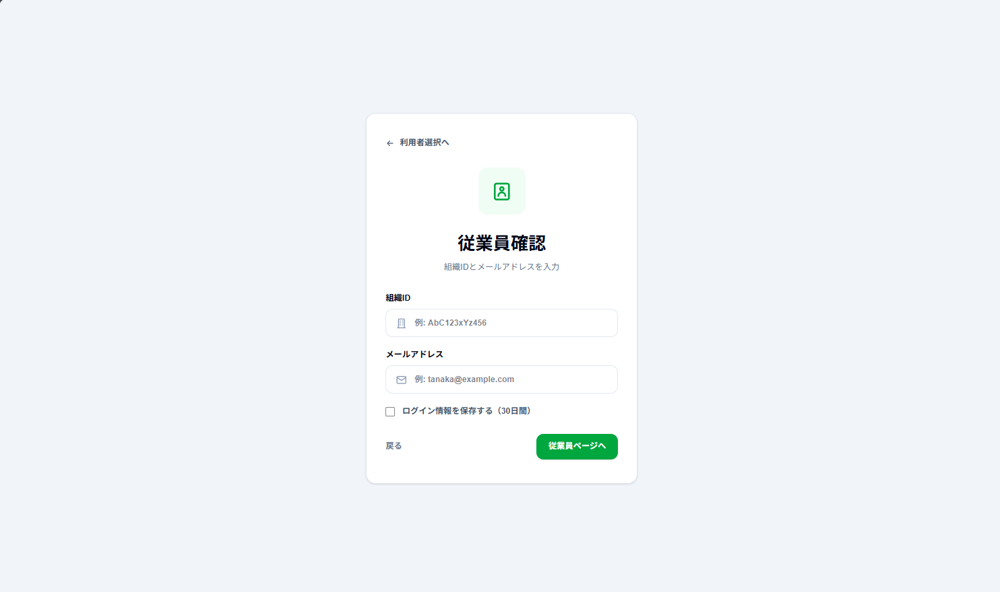 |  |

| 管理者新規登録 | 組織選択 |
| --- | --- |
| 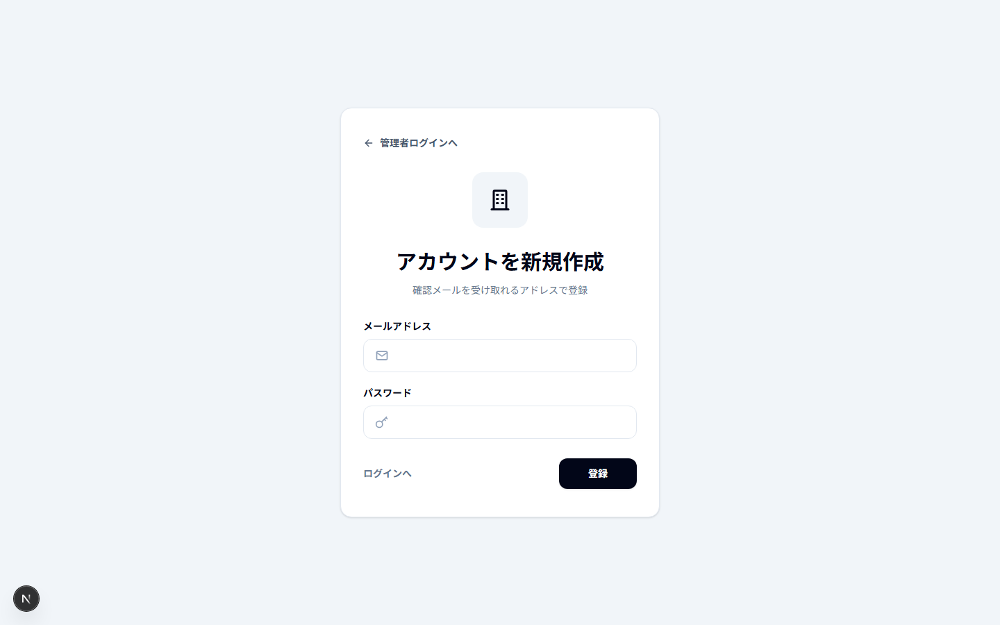 | 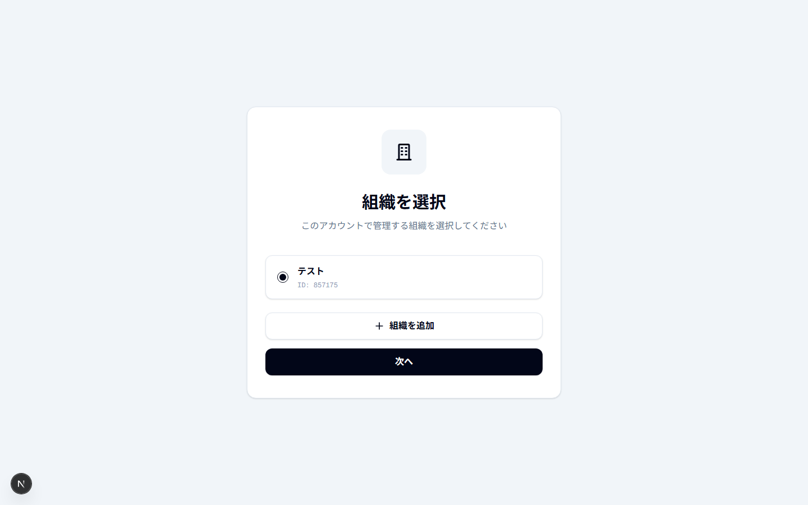 |

| 組織追加 |
| --- |
| 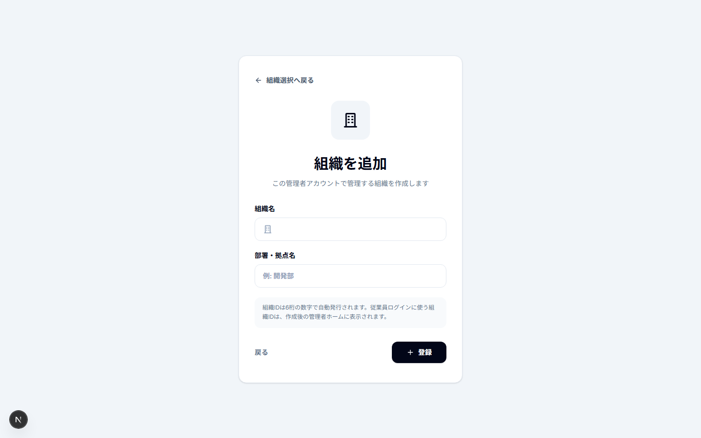 |

</details>

---

### 2. 管理者向け画面

管理者は、シフト枠、従業員、ポジション、勤務時間、給与、出力形式などをまとめて管理できます。  
シフト作成では、相性スコア・業務スキル・公平性スコアをもとにしたおすすめ候補を確認できます。

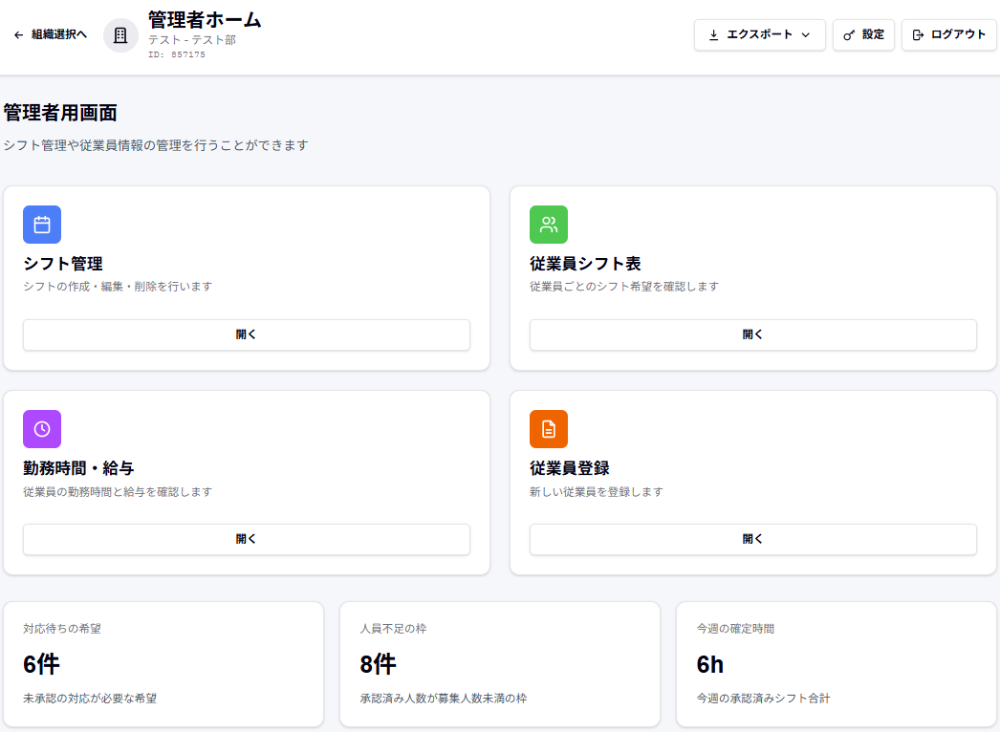

<details>
<summary><strong>管理者向け画面をすべて見る</strong></summary>

<details>
<summary><strong>シフト管理を見る</strong></summary>

#### シフト管理

月間カレンダーから日付を選び、日ごとのシフト枠・希望人数・承認状況を確認できます。  
管理者が作成したシフト枠だけでなく、従業員から届いた募集枠なしの希望も確認できます。


#### 日別シフト管理

選択した日のシフト枠を、時間帯ビューと一覧で確認できます。  
シフト枠ごとの希望人数、承認人数、募集人数も確認できます。

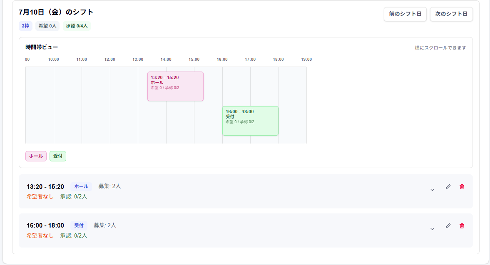

#### おすすめ承認

希望者が複数いる場合は、相性スコア、業務スキル、公平性スコアをもとに、おすすめの承認候補を表示します。  
おすすめ候補は一括で承認できます。

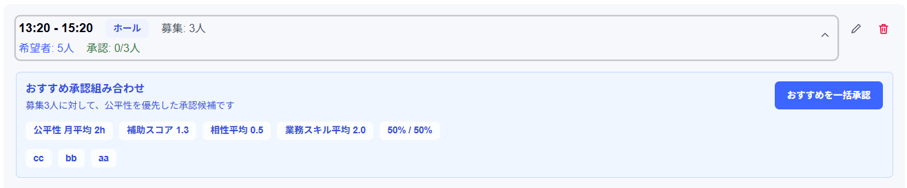

</details>

<details>
<summary><strong>従業員・ポジション管理を見る</strong></summary>

#### 従業員シフト表

従業員ごとの希望シフト、勤務予定、勤務済みシフトを確認できます。  
承認済みシフトについては、実勤務時間や実給与の補正もできます。

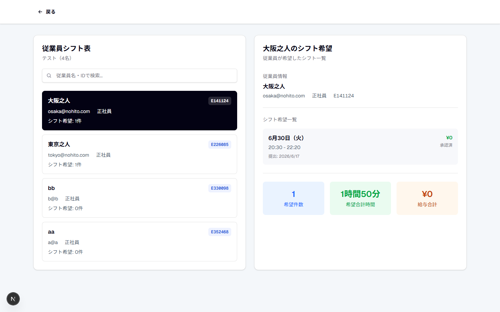

#### 従業員登録・ポジション管理

管理者は従業員を登録し、雇用形態や業務スキルを設定できます。  
また、シフト募集時に使うポジションも登録できます。

| 従業員登録 | ポジション一覧 |
| --- | --- |
| 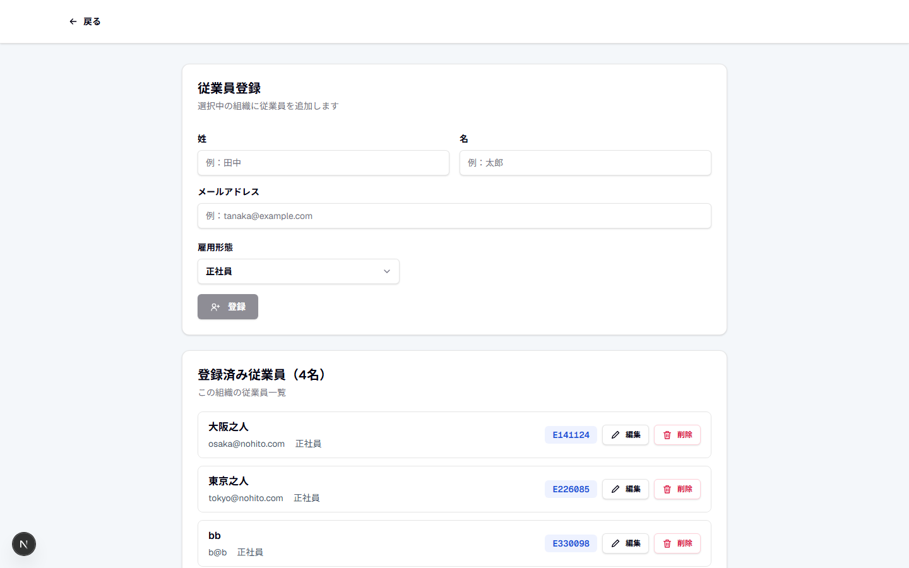 |  |

| ポジション追加 | 実績給与の編集 |
| --- | --- |
| 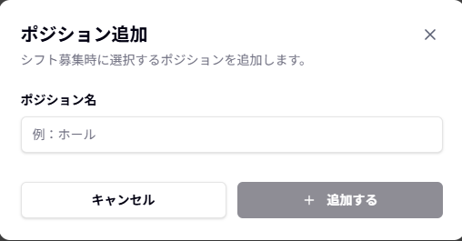 | 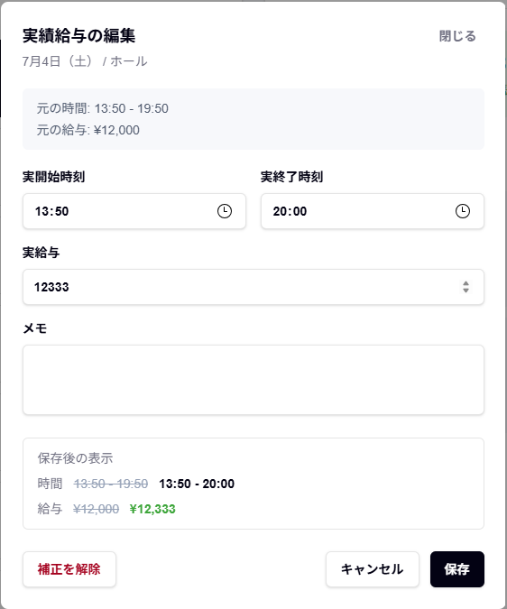 |

</details>

<details>
<summary><strong>勤務時間・給与管理を見る</strong></summary>

#### 勤務時間・給与管理

承認済みシフトをもとに、勤務時間と給与を自動で集計します。  
平均勤務時間、平均給与、合計勤務時間、合計給与、出勤人数、従業員別の勤務時間・給与を確認できます。


</details>

<details>
<summary><strong>設定を見る</strong></summary>

#### 設定

おすすめ計算、公平性スコア、自動承認、従業員の自主希望、給与設定などを管理できます。

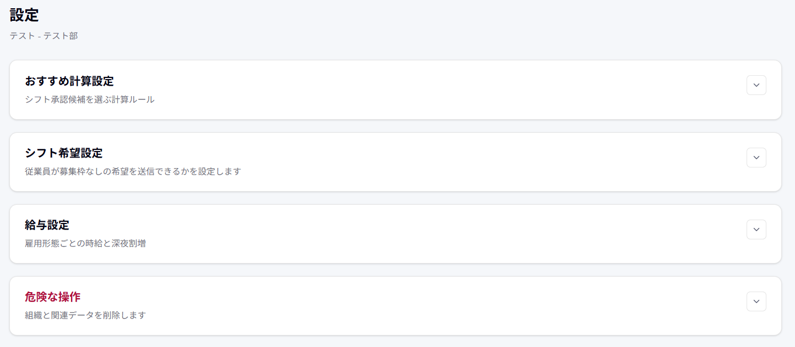

</details>

<details>
<summary><strong>エクスポートを見る</strong></summary>

#### エクスポート

管理者は、シフト表を PDF / CSV / Excel / 印刷用ページとして出力できます。  
出力単位は、月単位、月単位（一日ずつ）、日単位から選択できます。

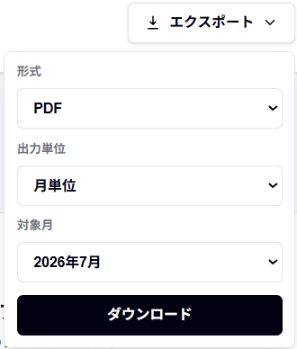

#### 出力例

| PDF | Excel |
| --- | --- |
| 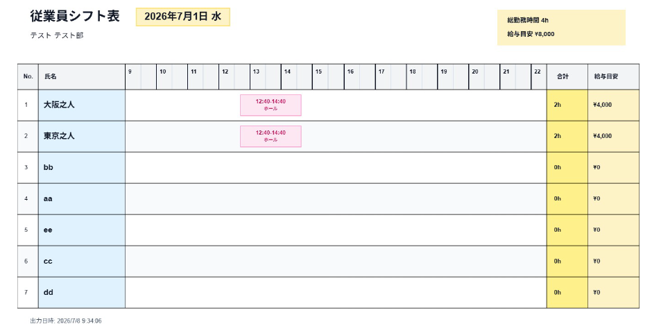 | 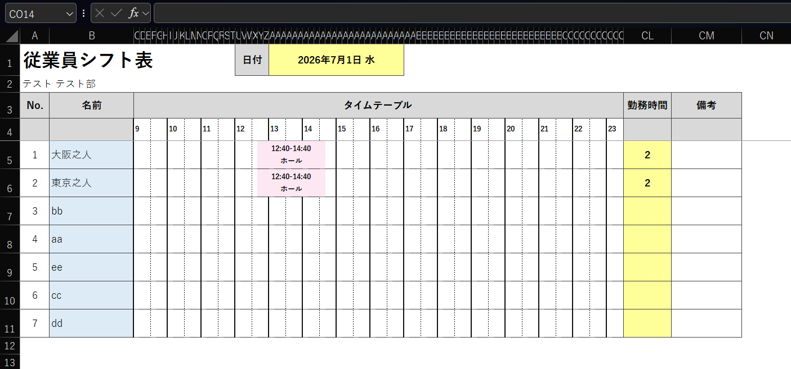 |

| CSV | 印刷プレビュー |
| --- | --- |
| 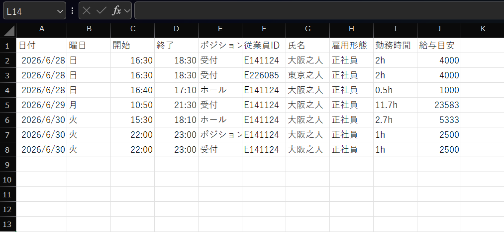 | 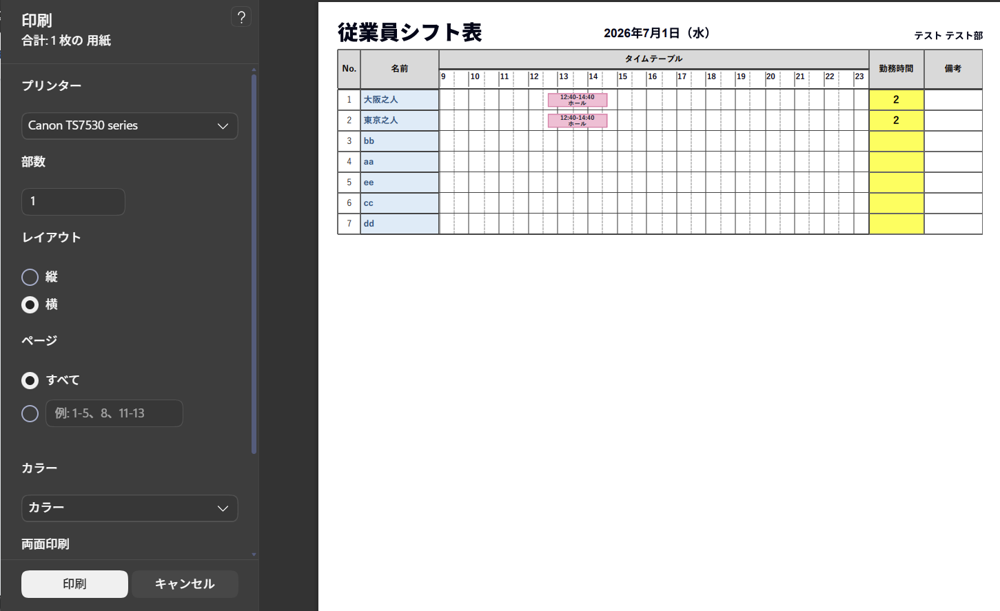 |

</details>

</details>

---

### 3. 従業員向け画面

従業員はアカウント作成不要で、組織IDとメールアドレスだけで利用できます。  
希望シフトの提出、勤務履歴の確認、相性スコアの入力、カレンダー連携ができます。

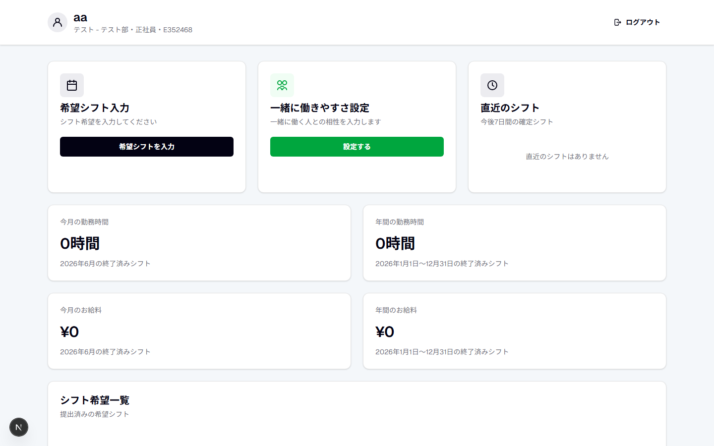

<details>
<summary><strong>従業員向け画面をすべて見る</strong></summary>

<details>
<summary><strong>希望シフト入力を見る</strong></summary>

#### 希望シフト入力

月間カレンダーと日別の時間ビューから、希望シフトを追加できます。  
送信前に追加した希望を確認し、まとめて提出できます。

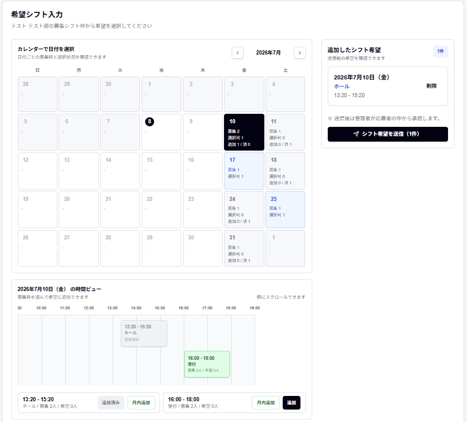

#### 募集枠なしの自主希望

管理者が許可している場合、従業員は募集されていない時間帯でも希望を追加できます。

| 時間ビューから追加 | 入力フォーム |
| --- | --- |
| 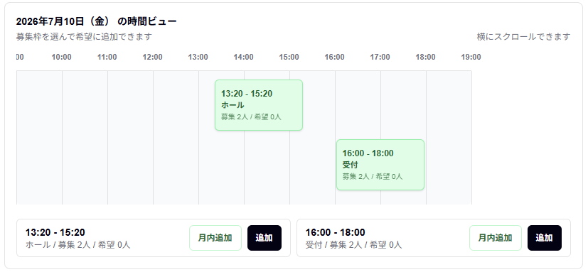 |  |

</details>

<details>
<summary><strong>勤務履歴・予定を見る</strong></summary>

#### 勤務履歴・予定

月ごとに、勤務予定、承認待ち、勤務済みのシフトを確認できます。  
選択月・年間の勤務時間や給与も確認できます。


</details>

<details>
<summary><strong>マイカレンダーを見る</strong></summary>

#### マイカレンダー

自分の確定シフトを月ごとに確認できます。  
日付を選ぶと、その日のシフトがタイムライン形式で表示されます。

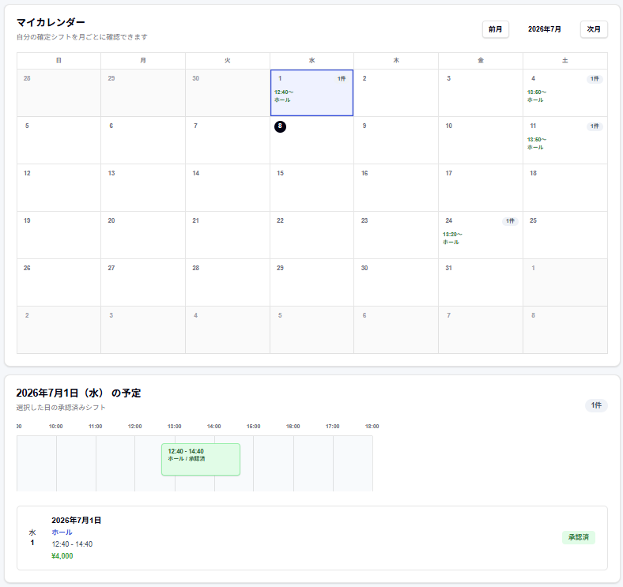

</details>

<details>
<summary><strong>一緒に働きやすさ設定を見る</strong></summary>

#### 一緒に働きやすさ設定

他の従業員との働きやすさを入力できます。  
入力された相性スコアは、管理者側のおすすめ承認候補の計算に使われます。

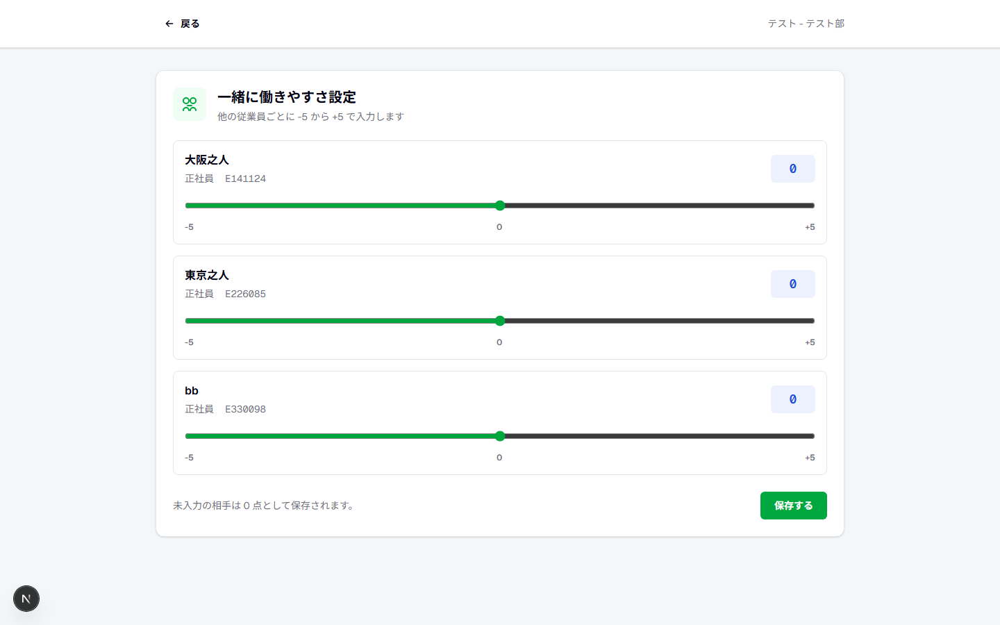

</details>

<details>
<summary><strong>エクスポート・カレンダー連携を見る</strong></summary>

#### エクスポート・カレンダー連携

従業員は、自分の確定シフトを PNG / ICS / カレンダー購読URL として出力できます。

| 従業員エクスポート | カレンダーアプリ |
| --- | --- |
| 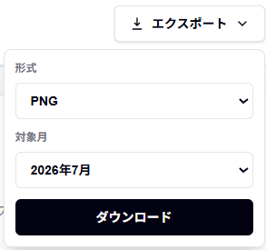 | 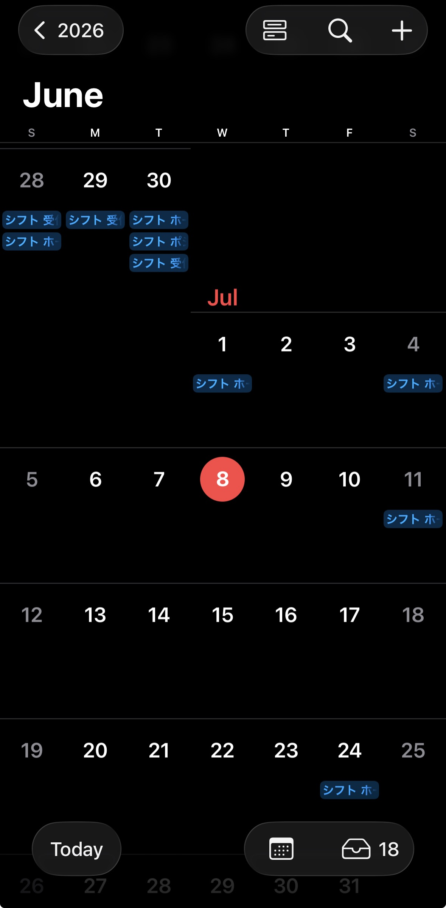 |

</details>

</details>

## 利用の流れ

### 管理者側

1. 管理者アカウントを作成する
2. 確認メールを開いてメール認証を完了する
3. 管理する組織を作成する
4. 従業員とポジションを登録する
5. シフト枠を作成する
6. 従業員から提出された希望を確認する
7. おすすめ候補を参考に承認する
8. 勤務時間・給与を確認する
9. 必要に応じて PDF / CSV / Excel / 印刷用ページを出力する

### 従業員側

1. 管理者から組織IDを受け取る
2. 組織IDとメールアドレスでログインする
3. 募集されているシフト枠から希望を提出する
4. 必要に応じて、募集枠なしの自主希望を提出する
5. 一緒に働きやすさを登録する
6. 承認状況や確定シフトを確認する
7. 自分のシフトを PNG / ICS / カレンダー購読URLで出力する

## 主な機能

Chess の機能は、大きく分けて「管理者向け」「従業員向け」「共通・設定」の3つに分かれます。

### 管理者向け

| 機能 | 内容 |
| --- | --- |
| 管理者ログイン | Firebase Authentication を使って、メールアドレスとパスワードでログインします。新規登録時には確認メールを送信し、メール確認が完了していない場合はログインできません。 |
| 組織管理 | 管理者は複数の組織を作成・選択できます。組織ごとにFirestoreの自動IDが発行され、従業員ログインに使用されます。 |
| 従業員管理 | 姓、名、メールアドレス、雇用形態、業務スキルを登録できます。従業員IDは自動発行され、希望シフトや勤務履歴と紐づきます。 |
| ポジション管理 | ホール、キッチン、レジなど、シフト募集時に使用するポジションを登録できます。登録したポジションは、シフト枠作成や従業員の自主希望で使用されます。 |
| シフト枠管理 | 日付、開始時間、終了時間、ポジション、募集人数を指定してシフト枠を作成できます。同じ曜日・時間・ポジションのシフト枠を月内でまとめて作成することもできます。 |
| 希望シフト管理 | 従業員が提出した希望シフトを確認・承認できます。承認済みのシフトは、従業員のマイカレンダーや勤務時間・給与計算に反映されます。 |
| 実績補正 | 勤務後に、実開始時間、実終了時間、実給与、メモを補正できます。補正内容を従業員画面に表示するかどうかも設定できます。 |
| 勤務時間・給与管理 | 承認済みシフトをもとに、平均勤務時間、平均給与、合計勤務時間、合計給与、出勤人数、従業員別の勤務時間・給与を確認できます。 |

### 従業員向け

| 機能 | 内容 |
| --- | --- |
| 従業員ログイン | 管理者から共有された組織IDと、登録済みのメールアドレスでログインできます。従業員側ではアカウント作成やパスワード登録は不要です。 |
| 希望シフト入力 | 募集されているシフト枠から希望を提出できます。送信前に、追加した希望を確認してまとめて提出できます。 |
| 募集枠なしの自主希望 | 管理者が許可している場合、管理者が作成したシフト枠がない時間でも、日付・開始時間・終了時間・ポジションを指定して希望を提出できます。 |
| 勤務履歴・予定 | 月ごとに、勤務予定、承認待ち、勤務済みのシフトを確認できます。選択月と年間の勤務時間・給与も確認できます。 |
| マイカレンダー | 自分の確定シフトを月ごとに確認できます。日付を選択すると、その日のシフトがタイムライン形式で表示されます。 |
| 一緒に働きやすさ設定 | 他の従業員との働きやすさを入力できます。入力された相性スコアは、管理者側のおすすめ承認候補の計算に使われます。 |
| 従業員エクスポート | 自分の確定シフトを PNG / ICS / ICSカレンダー購読URL として出力できます。カレンダー購読URLを使うことで、スマートフォンやPCのカレンダーアプリにシフトを追加できます。 |

### おすすめ候補・公平性

| 機能 | 内容 |
| --- | --- |
| おすすめ候補 | シフト枠ごとに、提出された希望の中からおすすめ候補を表示します。相性スコア、業務スキル、月内勤務時間、管理者が設定した重みをもとに計算します。 |
| 相性スコア | 従業員同士が入力した双方向の評価を平均して使います。 |
| 業務スキル | 管理者が従業員ごとに設定したスコアを使います。 |
| 公平性スコア | 勤務時間の偏りが少なくなるように候補を選びます。まず勤務時間が少ない従業員を優先し、同じ条件の場合に相性スコアや業務スキルを参考にします。 |
| おすすめ候補の一括承認 | 表示されたおすすめ候補を、管理者がまとめて承認できます。 |
| 自動承認 | おすすめ候補を自動で承認するルールを設定できます。手動承認、期限到達で自動承認、期間ごとの自動承認、対象範囲、確定タイミングなどを設定できます。 |

### 給与・出力・設定

| 機能 | 内容 |
| --- | --- |
| 給与設定 | 雇用形態ごとの時給、深夜開始時刻、深夜終了時刻、深夜倍率を設定できます。 |
| 管理者エクスポート | 承認済みシフトを PDF / CSV / Excel / 印刷用ページとして出力できます。出力範囲は、月単位、月単位（一日ずつ）、日単位から選択できます。 |
| シフト希望設定 | 従業員の自主希望を許可するか、実績補正を従業員画面に表示するかを設定できます。 |
| おすすめ計算設定 | おすすめ計算の重み、公平性スコアの有効・無効、自動承認ルールを設定できます。 |
| 組織削除 | 管理者は組織を削除できます。削除時には、組織に紐づく従業員、シフト枠、シフト希望、相性スコアなども削除対象になります。 |

## セキュリティ・データ整合性

認証情報や同時操作によるデータ不整合を防ぐため、以下の対策を実装しています。

| 対策 | 内容 |
| --- | --- |
| 従業員セッション | 署名付きHTTPOnly Cookieを使用します。従業員の氏名・メールアドレス変更や再割当時には認証バージョンを更新し、既存セッションを無効化します。 |
| カレンダー購読情報 | 従業員の再割当・削除、組織削除時に古いカレンダー購読情報を削除します。購読URLも従業員の認証バージョンと紐づけて管理します。 |
| シフト申請・承認 | Firestoreトランザクションと重複排除キーを使い、同時申請や同一内容の重複送信による二重登録・定員超過を防ぎます。 |
| 給与スナップショット | シフト希望の提出時点の雇用形態・時給を保存します。後から給与設定を変更しても、既存のシフト希望の給与計算は変わりません。 |
| CSV出力 | `=`, `+`, `-`, `@` などで始まる数式形式の値を無害化し、CSVを表計算ソフトで開いた際の数式インジェクションを防止します。 |
| Firestore Rules | メール認証済みで対象組織に所属する管理者だけが、組織の管理データを操作できるように制限しています。 |

## ローカルで起動

### 開発環境の準備

開発ツールは `mise.toml` で管理しています。Firebase Emulatorを使うためのJavaを含め、以下のバージョンを揃えます。

- Java: Temurin 21
- Node.js: 24.16.0
- Firebase CLI: 15.22.0

初回は、プロジェクトのルートで以下を実行してください。

```bash
mise trust
mise install
npm install
```

`mise trust` は、環境によって不要な場合があります。

### アプリを起動する

```bash
npm run dev
```

<http://localhost:3000> をブラウザで開きます。

## 利用できるコマンド

```bash
npm run dev
```

開発サーバーを起動します。

```bash
npm run build
```

本番用にビルドします。

```bash
npm run start
```

ビルド後のアプリを起動します。

```bash
npm run lint
```

ESLint を実行します。

```bash
npm run security:emulator
```

Firestore EmulatorとAuth Emulatorをローカルで起動し、本番ビルドしたNext.jsアプリを使って動的検証を実行します。デフォルトではFirestoreを `8080`、Authを `9099`、Emulator UIを `4000`、検証用のNext.jsを `3099` で起動します。検証データは終了時に削除され、外部のFirebaseプロジェクトには接続しません。

このコマンドでは、従業員の互換性情報、給与スナップショット、シフト申請の重複排除、カレンダー購読情報の削除を検証します。Java、Firebase CLI、子プロセス起動、ループバック通信が必要です。

```bash
npm run security:csv
```

CSV出力の数式インジェクション対策を確認する回帰テストを実行します。Firebase Emulatorは使用しません。

詳細な検証方針は [`SECURITY.md`](./SECURITY.md) を参照してください。

## 環境変数

Firebase の接続情報は、プロジェクト直下の `.env.local` に設定してください。

```env
NEXT_PUBLIC_FIREBASE_API_KEY=
NEXT_PUBLIC_FIREBASE_AUTH_DOMAIN=
NEXT_PUBLIC_FIREBASE_PROJECT_ID=
NEXT_PUBLIC_FIREBASE_STORAGE_BUCKET=
NEXT_PUBLIC_FIREBASE_MESSAGING_SENDER_ID=
NEXT_PUBLIC_FIREBASE_APP_ID=

FIREBASE_ADMIN_PROJECT_ID=
FIREBASE_ADMIN_CLIENT_EMAIL=
FIREBASE_ADMIN_PRIVATE_KEY=

EMPLOYEE_SESSION_SECRET=
```

`EMPLOYEE_SESSION_SECRET` は、従業員セッションCookieの署名に使うサーバー専用のランダム文字列です。  
本番環境にも同じ名前で設定してください。

## 技術構成

- Next.js 16
- React 19
- TypeScript
- Tailwind CSS
- Firebase Authentication
- Cloud Firestore
- Firebase Admin SDK
- Firebase Emulator Suite（Firestore / Auth）
- mise（Java / Node.js / Firebase CLIの管理）

## ディレクトリ構成

主なディレクトリは以下です。

```txt
src/
  app/
    (auth)/
      login/
      signup/
    (manager)/
      manager/
      admin/
    (employee)/
      employee/
    api/
      employee/
  components/
  lib/
scripts/
  security/
```

### 主な役割

| ディレクトリ | 内容 |
| --- | --- |
| `src/app/(auth)` | ログイン・新規登録画面 |
| `src/app/(manager)` | 管理者向け画面 |
| `src/app/(employee)` | 従業員向け画面 |
| `src/app/api` | APIルート |
| `src/components` | 共通UIコンポーネント |
| `src/lib` | Firebase操作・計算ロジック・エクスポート処理 |
| `scripts/security` | Emulatorを使った動的検証・CSV出力の回帰テスト |


## スクリーンショット

スクリーンショットは `readme-screenshots` に保存しています。


## 注意事項

- `.env.local` は GitHub にコミットしないでください
- Firebase Admin の秘密鍵は公開しないでください
- 本番環境では、Vercel などの環境変数に秘密情報を設定してください
- Firestore Rules は本番運用前に適切に設定してください
- テキストファイルの改行コードは `.gitattributes` によりLFに統一しています
